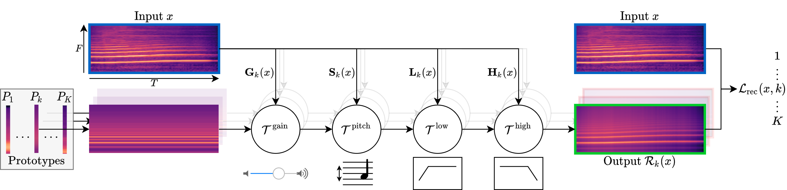

<div align="center">
  <h1>A Model You Can Hear:</h1>
  <h1>Audio Identification with Playable Prototypes</h1>
  <h1></h1>
</div>


## Description
Official PyTorch implementation of the paper [**"A Model You Can Hear: Audio Identification with Playable Prototypes"**](https://romainloiseau.fr/a-model-you-can-hear/).

Please visit our [**webpage**](https://romainloiseau.fr/a-model-you-can-hear/) for more details.



## Installation :construction_worker:

### 1. Clone the repository in recursive mode

```
git clone git@github.com:romainloiseau/a-model-you-can-hear.git --recursive
```

### 2. Clone, create and activate conda environment

This implementation uses Pytorch.

**Optional:** some monitoring routines are implemented with `tensorboard`.

**Note:** this implementation uses [`pytorch_lightning`](https://www.pytorchlightning.ai/) for all training routines and [`hydra`](https://hydra.cc) to manage configuration files and command line arguments.

## How to use :rocket:

### Training the model

To train our best model, launch :
```bash
python main.py \
  +experiment={$dataset}_ours_{$supervision}
```

with `dataset` in `{libri, sol}` and `supervision` in `{sup, unsup}`

### Testing the model

To test the model, launch :
```bash
python test.py \
  +experiment={$dataset}_ours_{$supervision} \
  model.load_weights="/path/to/trained/weights.ckpt"
```

**Note:** pretrained weights to come in `pretrained_models/`

### Citation   
```
@article{loiseau22online,
  title={A Model You Can Hear: Audio Identification with Playable Prototypes.},
  author={Romain Loiseau and Baptiste Bouvier and Yan Teytaut and Elliot Vincent and Mathieu Aubry and Loic Landrieu},
  journal={ISMIR},
  year={2022}
}
```
